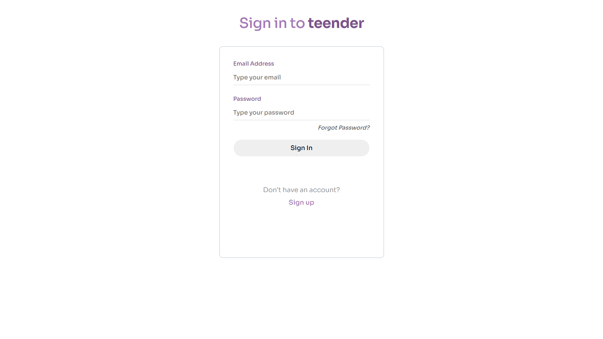
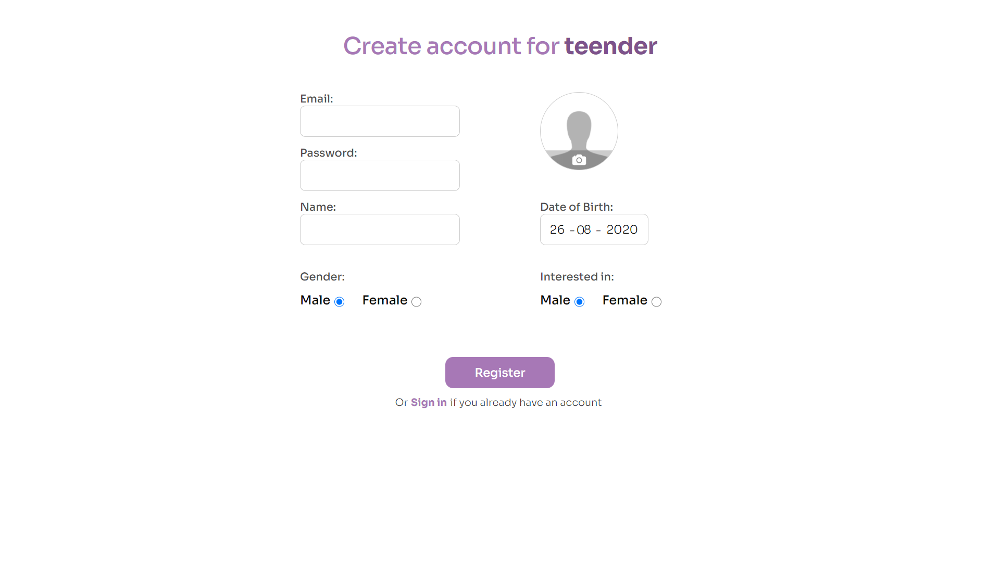
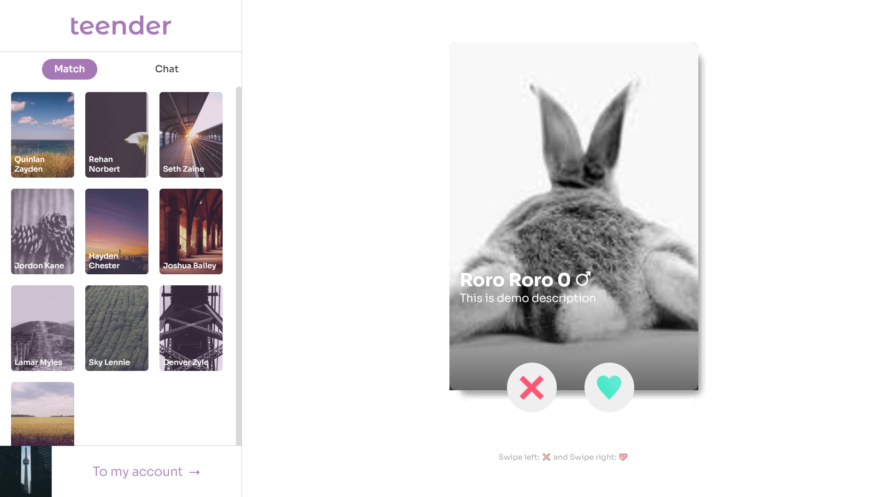
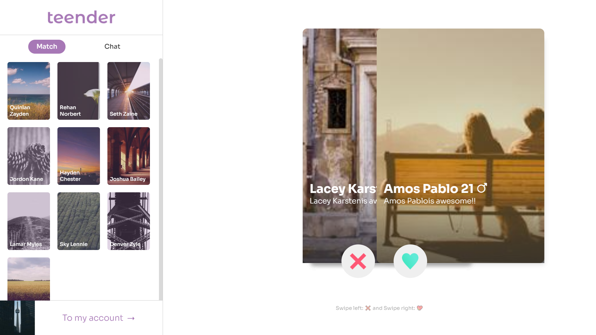
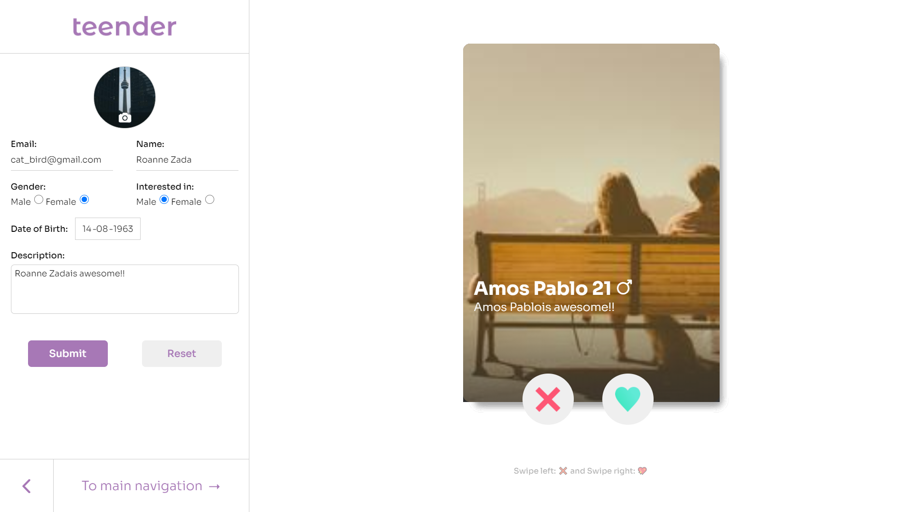
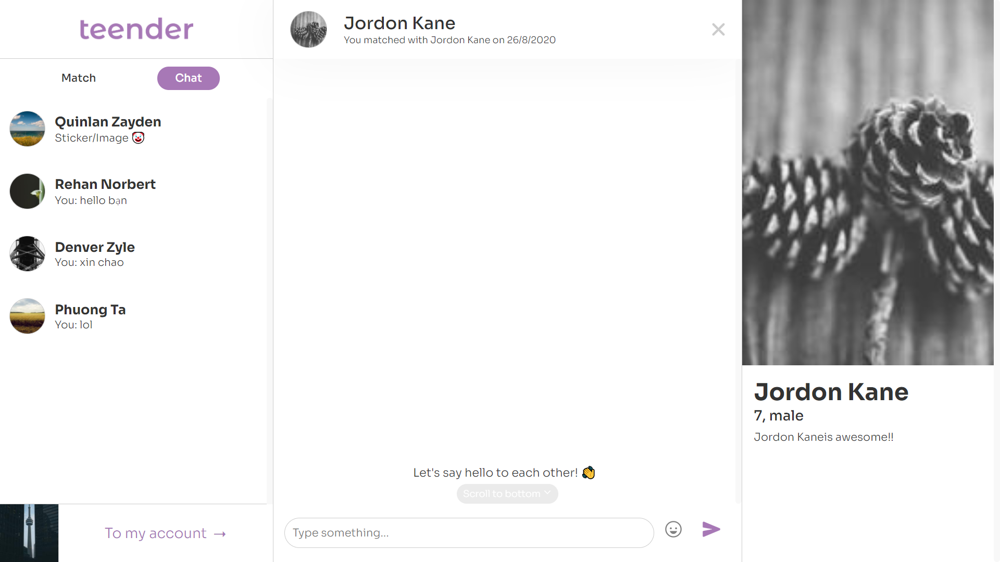
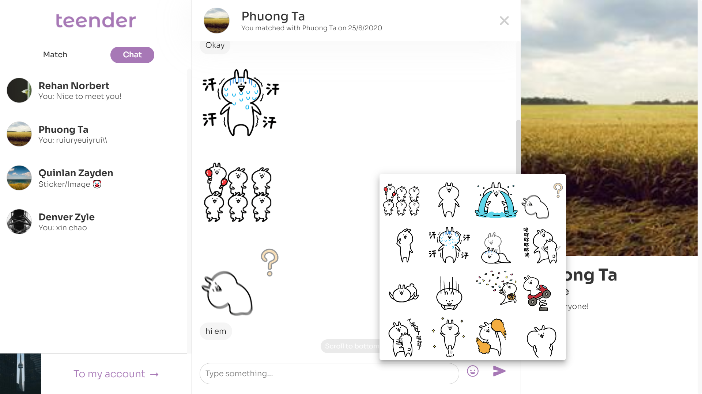
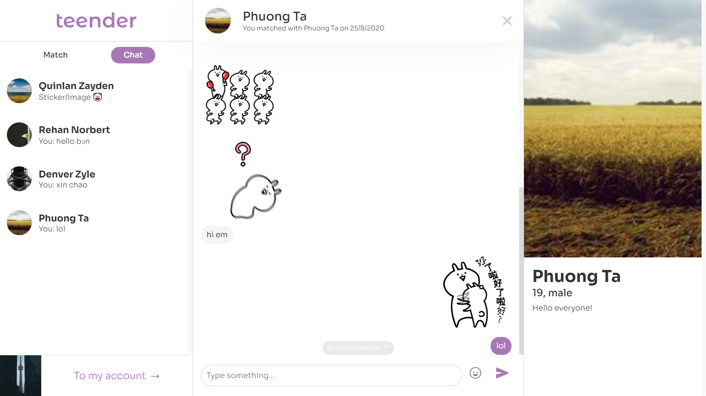

# Teender 
As you guys could realize from the name, this is a clone of Tinder! This was made as a final project with my team, graduating the 3-month web-fullstack course. Tech stack: MERN Stack, socket.io and Imgur for hosting images. Hosted by Heroku free tier.
#

## Disclaimer!!:
Because I'm using the free tier (Haha) of Heroku and MongoDB therefore the transfering-speed is kinda slow compared to other websites. Please be patient, especially when you first opened the website it would took up to 1 minute to wake the Heroku server. The first actions (swiping, update profile) would be really slow (not gonna lie), and yep I forgot to make some "loading sites" to notify whether the website is really loading or just standing still. Thanks for your understanding :(

This website is j4f, but if it does help you educationally or is informative to you, it would be a pleasure to me ;) Any further discussions, comments or feedback you can contact me via mail (tahaphuongz@gmail.com). I'd love to hear from you ;)
<br>
Demo link: <a href="http://teenderz.herokuapp.com/">http://teenderz.herokuapp.com/</a>
<br>

**Test accounts:** 
<br>
cat_bird@gmail.com - Password: 123456
<br>
water_solar@gmail.com - Password: 123456


#

## Functions:
- Create account, update your profile, upload a nice avatar
- Swiping
- When there's a match, you can chat with the person you matched ;)
- You can know if the person you matched/chating with **online** or not (socket.io)
- Realtime messages: You can recieve the message immadiately if you're online and chatting (socket.io)

## Preview pics:
<br>










<br/>

## Run this in your local: 
I will guide you through the steps needed to run this

### Please notice:
I'm not professional programmer, therefore there would be a lot of bugs in this web app and also some mistakes in this guidelist. Please consider my guides only as reference, *not* as an accurate source of information. Thank you ;)

### Preparation:
- You need to register an Imgur app to get your Imgur Client ID.
- Create a mongoDB Cluster. You could also write a DB-autogenerated programms to create users and save the database to MongoDB. 
Create a username and a password for your database.
- Save those infos as CLIENT_ID_IMGUR, USERNAME_MONGO and PASSWORD_MONGO to environments vars (.env file in the root directory for local run). Also create a var named SECRET_STRING for the tokens encryption.

### Running:

```$ npm install```
<br/>
```$ npm start```

Type <a src="http://localhost:9000/" style="cursor: pointer">localhost:9000</a> in your browser and yep, press Enter.

Done, the website should work by now ;)

## Bottom lines:

Thank you for reading all those contents above ;) Have a good day ;)

*This website is j4f, but if it does help you educationally or is informative to you, it would be a pleasure to me ;) Any further discussions, comments or feedback you can contact me via mail (tahaphuongz@gmail.com). I'd love to hear from you ;)*


